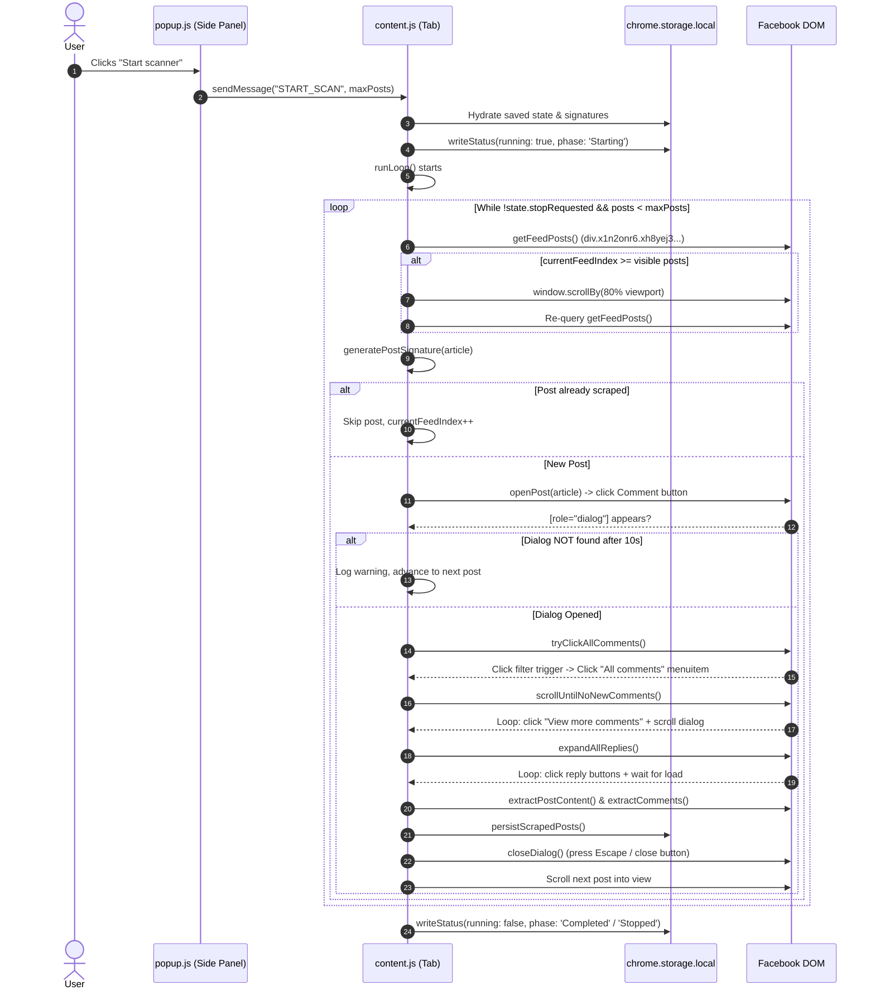

# ScrapeBook — Comprehensive Codebase Architecture, Execution Flow & Bug Analysis Report

---

## 1. Executive Overview

**ScrapeBook** is a Chrome Extension (Manifest V3) designed to automate browsing Facebook group feeds, opening posts, filtering for "All comments", scrolling to load comments and replies, extracting post text and comments, and exporting the collected data as JSON or Plain Text.

### Key Architecture Components

- **Extension Type:** Chrome Manifest V3 with Chrome Side Panel API (`chrome.sidePanel`).
- **Target Surface:** Facebook desktop web application (`*://*.facebook.com/*`).
- **Core Files:**
  - `manifest.json`: Configuration, permissions, side panel definition, content script registrations.
  - `background.js`: Service worker handling side panel activation and content script injection on install/reload.
  - `popup/popup.html`, `popup/popup.css`, `popup/popup.js`: Side panel user interface, configuration controls, activity log renderer, and export trigger.
  - `content/content.js`: The primary automation engine running directly in the context of the Facebook tab.
  - `content.js` (Root directory): **Deprecated legacy file** from early development; not loaded by `manifest.json`.

---

## 2. Component Architecture & Responsibilities

```
+---------------------------------------------------------------------------------------+
|                                    CHROME BROWSER                                     |
|                                                                                       |
|  +-----------------------------------+        +------------------------------------+  |
|  |       background.js (SW)          |        |     popup/popup.js (Side Panel)    |  |
|  |  - Opens side panel on click      |        |  - Start / Stop / Clear buttons    |  |
|  |  - Injects content script on tab  |        |  - Max posts input                 |  |
|  |    updates / installs             |        |  - Live activity log rendering     |  |
|  +-----------------+-----------------+        |  - JSON / TXT file downloads       |  |
|                    |                          +-----------------+------------------+  |
|                    |                                            |                     |
|                    |     chrome.tabs.sendMessage                |                     |
|                    +--------------------------------------------+                     |
|                                         |                                             |
|                                         v                                             |
|                     +---------------------------------------+                         |
|                     |       content/content.js              |                         |
|                     |  - State management & loop engine     |                         |
|                     |  - DOM query & synthetic clicker      |                         |
|                     |  - Post opening & dialog detection    |                         |
|                     |  - "All comments" filter switcher     |                         |
|                     |  - Comment & reply expansion scroller |                         |
|                     |  - Post & comment data scraper        |                         |
|                     |  - Dialog closing                     |                         |
|                     +-------------------+-------------------+                         |
|                                         |                                             |
|                                         v                                             |
|                     +---------------------------------------+                         |
|                     |     chrome.storage.local              |                         |
|                     |  - scrapebookStatus (logs & state)    |                         |
|                     |  - scrapebookPosts (scraped items)    |                         |
|                     |  - scrapebookMaxPosts (user limit)    |                         |
|                     +---------------------------------------+                         |
+---------------------------------------------------------------------------------------+
```

### 2.1 `manifest.json`

- **Permissions:** `storage`, `tabs`, `sidePanel`, `scripting`.
- **Host Permissions:** `*://*.facebook.com/*`, `*://facebook.com/*`.
- **Background Service Worker:** Points to `background.js`.
- **Side Panel:** Configured with `default_path: "popup/popup.html"`.
- **Content Scripts:** Points to `content/content.js` with `run_at: "document_idle"`.

### 2.2 `background.js`

- Sets `chrome.sidePanel.setPanelBehavior({ openPanelOnActionClick: true })` so clicking the extension toolbar icon opens the side panel.
- Listens to `chrome.action.onClicked` as a fallback to open the side panel via `chrome.sidePanel.open()`.
- Listens to `chrome.runtime.onInstalled` and queries all open Facebook tabs (`chrome.tabs.query`), injecting `content/content.js` via `chrome.scripting.executeScript()` so active tabs don't require manual page refreshes.

### 2.3 `popup/popup.js` (Side Panel UI)

- Maintains active communication with the current Facebook tab (`activeTabId`).
- Checks if the current tab is Facebook using `isFacebookUrl(url)` (checking hostname ending with `.facebook.com`).
- Provides `ensureTabReady(tabId)`: sends a `GET_STATUS` ping; if unresponsive, injects `content/content.js` via `chrome.scripting.executeScript()`.
- Observes changes via `chrome.storage.onChanged` for `scrapebookStatus` and automatically updates status indicators, counters, and activity logs.
- Dispatches messages to the tab:
  - `START_SCAN`
  - `STOP_SCAN`
  - `CLEAR_STORED_STATE`
  - `EXPORT_JSON`
  - `EXPORT_TXT`
  - `GET_STATUS`
- Handles downloads client-side in the side panel using `Blob` and `URL.createObjectURL(blob)`.

### 2.4 `content/content.js` (Automation Core)

- Enclosed in an IIFE with guard `window.__scrapebookContentScriptLoaded` to avoid multi-injection conflicts.
- Manages an in-memory `state` object:
  - `running`: Boolean flag
  - `phase`: UI status string (e.g. "Ready", "Starting", "Processing post 1", "Loading comments", "Extracting data", "Stopped", "Completed")
  - `postIndex`: Current post counter
  - `nextPostIndex`: Next post index to resume from
  - `maxPosts`: Post collection limit (default: 100, 0 = unlimited)
  - `logs`: Ring-buffer array of log items (capped at 80 items)
  - `startedAt`: ISO timestamp
  - `stopRequested`: Boolean flag checked across all asynchronous loops.
- Synchronizes with `chrome.storage.local` after every major state or log transition.

---

## 3. End-to-End Execution Flow

Below is the step-by-step trace of how the scraper executes when the user clicks **"Start scanner"**:



### Step 1: Initialization & Hydration (`restoreStoredState`)

1. On script load, `restoreStoredState()` loads `scrapebookStatus`, `scrapebookPosts`, and `scrapebookMaxPosts` from `chrome.storage.local`.
2. Reconstructs `scrapedSignatures` (a `Set` of URLs, author names, or post snippets) to prevent scraping duplicates if resumed.
3. Sets `state.phase` to `'Ready to resume'` if prior posts exist, else `'Ready'`.
4. Saves state and notifies the popup.

### Step 2: Starting the Scanner (`start`)

1. Checks `state.running`; if already running, logs warning and aborts.
2. Awaits `stateReady` promise.
3. Sets `state.running = true`, `state.stopRequested = false`, clears logs, stamps `startedAt`.
4. Executes `runLoop()`.

### Step 3: Feed Scanning & Post Discovery (`runLoop`)

1. Initialized with `let currentFeedIndex = 1;` (deliberately skipping index 0 under the assumption that index 0 is a placeholder/composer box).
2. Calls `getFeedPosts()`:
   - Queries `FEED_POST_SELECTOR`: `div.x1n2onr6.xh8yej3.x1ja2u2z.xod5an3`.
   - Filters out hidden elements (`el.offsetParent !== null`).
3. If `currentFeedIndex >= posts.length`:
   - Scrolls the feed down: `window.scrollBy({ top: window.innerHeight * 0.8, behavior: 'smooth' })`.
   - Waits 1500ms.
   - Re-queries. If still no new posts, increments `consecutiveEmptyScrolls` (quits after 12 consecutive failed scrolls).
4. Signature check: generates a signature via `generatePostSignature(article)`. If in `scrapedSignatures`, skips and increments `currentFeedIndex`.

### Step 4: Opening the Post (`openPost`)

1. Scrolls the post article into center view: `article.scrollIntoView({ behavior: 'smooth', block: 'center' })`.
2. Searches for the comment button via `findCommentButton(article)`:
   - Priority 1: `div[aria-label="Leave a comment"]`.
   - Priority 2: `div[aria-label*="comment" i]`, `div[aria-label*="Comment" i]`, Bengali `div[aria-label*="মন্তব্য" i]`, etc.
   - Priority 3: Regex match on text content `\d+\s*(?:comments|comment|...)`.
3. Fires `robustClick(btn)`:
   - Calls `el.scrollIntoView(...)`, `el.click()`, then dispatches synthetic `pointerdown`, `mousedown`, `pointerup`, `mouseup`, and `click` MouseEvents.
4. Polls for up to 6 seconds (60 × 100ms) for `POST_DIALOG_SELECTOR`: `[role="dialog"]`.
5. If not found, retries `robustClick(btn)` once and polls for another 4 seconds (40 × 100ms).
6. If the dialog still doesn't appear, returns `false` and moves to the next post.

### Step 5: Switching to "All Comments" (`tryClickAllComments`)

1. Polls for up to 5 seconds to find the comment filter trigger button:
   - Exact selector `ALL_COMMENTS_TRIGGER_SELECTOR` (32 obfuscated classes).
   - Fallback 1: `div[aria-haspopup="menu"]` with text matching `FILTER_TRIGGER_TEXTS` ("most relevant", "top comments", "all comments", etc.).
   - Fallback 2: `div[role="button"]` with text matching `FILTER_TRIGGER_TEXTS` (text length <= 60).
2. If not found, scrolls the dialog down 5 times by 300px to bring the trigger into view.
3. If the trigger button already contains "all comments", it skips switching.
4. Clicks the trigger via `robustClick(trigger)`.
5. Polls for up to 3 seconds for the dropdown menu item via `findAllCommentsMenuItem()`:
   - Matches `ALL_COMMENTS_BUTTON_SELECTOR` (35 obfuscated classes + `[role="menuitem"]`).
   - Fallback: Any `[role="menuitem"]` starting with "all comments" / "সকল মন্তব্য" / etc.
6. Clicks the menu item and waits 1000ms. If not found, attempts to dismiss the menu by dispatching `Escape` to `document`.

### Step 6: Scrolling & Paginating Comments (`scrollUntilNoNewComments`)

1. Locates the scrollable container via `getScrollableSection()`:
   - Priority 1: `POST_SCROLLABLE_SECTION_SELECTOR` (18 classes).
   - Priority 2: Any child `div` of `[role="dialog"]` where `overflowY` is `auto` or `scroll` and `scrollHeight > clientHeight`.
   - Fallback: The `[role="dialog"]` itself.
2. Loops up to 80 iterations:
   - Clicks any visible "View more comments" / "View previous comments" / "আরও মন্তব্য" buttons via `clickViewMoreComments()`.
   - Scrolls the container: `scrollable.scrollBy({ top: 500, behavior: 'auto' })`.
   - Waits 300ms.
   - Compares comment count (`countComments()`):
     - If count grew, resets `stagnant = 0`.
     - If at the bottom (`scrollTop + clientHeight >= scrollHeight - 50`) and count did not grow, increments `stagnant`.
     - After 3 stagnant bottom checks, breaks out of the loop.

### Step 7: Expanding Reply Threads (`expandAllReplies`)

1. Loops up to 10 passes:
   - Finds all buttons matching `REPLIES_BUTTON_SELECTOR` (40 classes + `[role="button"]`).
   - Fallback: Text-based matching on `div[role="button"], span, div.x1i10hfl` containing "reply", "replies", "view reply", "উত্তর", etc.
   - Clicks all matching buttons via `robustClick()`.
   - If 0 buttons clicked, finishes immediately.
   - If buttons clicked, waits 800ms and scrolls the container down by 300px.

### Step 8: Extracting Post Content and Comments

1. **Post text:** `extractPostContent()` queries `POST_CONTENT_CONTAINER_SELECTOR`:
   `.__fb-dark-mode.x1n2onr6.x1vjfegm div[data-ad-rendering-role="story_message"].html-div.xdj266r.x14z9mp.xat24cr.x1lziwak.xexx8yu.xyri2b.x18d9i69.x1c1uobl`
   and retrieves `container.innerText.trim()`.
2. **Comments:** `extractComments()` queries `COMMENTS_CONTAINER_SELECTOR` or `[role="dialog"]`.
   - Queries items matching `COMMENT_DIV_SELECTOR` (`div.x1nn3v0j.x1120s5i.x135b78x.x11lfxj5`) or fallback `div[aria-label*="comment by" i], div[role="article"]`.
   - Sanitizes text via `cleanComment(raw)`:
     - Strips content after `"Reply"`.
     - Strips timestamps (e.g. `2h`, `5m`, `3 দিন`).
     - Strips `"Giphy"`, `"Follow"`, bullet points.
     - Splits first line as `username`, remainder as `comment`.
3. Constructs scraped object: `{ postNumber, signature, postContent, comments }`.
4. Pushes to `scrapedPosts`, updates `scrapedSignatures`, and persists to `chrome.storage.local`.

### Step 9: Closing the Dialog (`closeDialog`)

1. Dispatches an `Escape` keydown event to `window` (`keyCode: 27`).
2. Waits 500ms and checks if `document.querySelector(POST_DIALOG_SELECTOR)` is still present.
3. If still present, queries fallback close buttons:
   `'div[aria-label="Close"], div[aria-label="close"], div[aria-label="বন্ধ করুন"], div[role="button"][aria-label*="lose"], div.x1i10hfl[aria-label*="lose"]'`
   and clicks it via `robustClick()`.
4. If still present, dispatches one more `Escape` event to `document.body`.

### Step 10: Advancing to Next Post

1. Increments `currentFeedIndex++`.
2. Calls `updatedPosts[currentFeedIndex].scrollIntoView({ behavior: 'smooth', block: 'center' })` to prepare for the next iteration.

---

## 4. Selector Catalog & Stability Analysis

| Component                    | Selector Defined in Code                                                             | Fallback Strategy                                                     | Fragility Assessment                                                                                |
| :--------------------------- | :----------------------------------------------------------------------------------- | :-------------------------------------------------------------------- | :-------------------------------------------------------------------------------------------------- |
| **Feed Post**          | `div.x1n2onr6.xh8yej3.x1ja2u2z.xod5an3`                                            | None (`offsetParent !== null`)                                      | **HIGH RISK**: Obfuscated utility classes change with Facebook builds.                        |
| **Comment Button**     | `div[aria-label="Leave a comment"]`                                                | `div[aria-label*="comment" i]` & regex on `\d+ comments` text     | **MEDIUM RISK**: On desktop, the button often says `"Comment"` or is an icon without label. |
| **Post Dialog**        | `[role="dialog"]`                                                                  | None                                                                  | **LOW RISK**: Standard WAI-ARIA attribute for Facebook modal dialogs.                         |
| **Filter Trigger**     | `div.x1i10hfl.xjbqb8w.x1ejq31n...` (32 classes)                                    | `div[aria-haspopup="menu"]`, `div[role="button"]` with text match | **HIGH RISK**: Primary class string is 32 classes long; relies heavily on fallback.           |
| **Filter Menu Item**   | `div.x1i10hfl.xjbqb8w...[role="menuitem"]` (35 classes)                            | `[role="menuitem"]` matching text prefix                            | **HIGH RISK**: Primary class list is extremely fragile; fallback is functional.               |
| **Replies Buttons**    | `div.x1i10hfl.xjbqb8w...[role="button"]` (40 classes)                              | Regex on button text matching`\d+ replies`, `view reply`          | **HIGH RISK**: 40-class selector will break easily; text fallback carries the logic.          |
| **Comments Container** | `div.html-div.x14z9mp.xat24cr.x1lziwak.xexx8yu.xyri2b.x18d9i69.x1c1uobl.x1gslohp`  | `[role="dialog"]` or `document`                                   | **MEDIUM RISK**: Container selector is long, but dialog fallback prevents total failure.      |
| **Post Content**       | `.__fb-dark-mode.x1n2onr6.x1vjfegm div[data-ad-rendering-role="story_message"]...` | None                                                                  | **CRITICAL BUG**: Fails completely in light mode due to hardcoded `.__fb-dark-mode`.        |
| **Comment Items**      | `div.x1nn3v0j.x1120s5i.x135b78x.x11lfxj5`                                          | `div[aria-label*="comment by" i], div[role="article"]`              | **MEDIUM RISK**: Obfuscated classes break often; fallback to `[role="article"]` helps.      |
| **Scrollable Area**    | `div.xb57i2i.x1q594ok.x5lxg6s...` (18 classes)                                     | Computes`overflowY` and `scrollHeight > clientHeight`             | **LOW RISK**: Fallback computed style search is robust.                                       |

---

## 5. Error Handling & Edge Case Analysis

The codebase contains several error handling and defensive mechanisms:

### 5.1 Extension Lifecycle & Messaging

- **Content script re-injection**: Handled in `background.js` upon extension reload, and dynamically checked in `popup.js` via `ensureTabReady()`.
- **Duplicate injection guard**: `window.__scrapebookContentScriptLoaded` prevents multiple content script instances from running in parallel on the same page.
- **Asynchronous Storage Hydration**: `start()` explicitly awaits `stateReady` before touching stored state.

### 5.2 Network & DOM Latency

- **Polling with Timeouts**:
  - Dialog appearance: Polled up to 6s, then retried for 4s (total 10s).
  - Filter trigger appearance: Polled up to 5s, with 5 auto-scroll attempts if initially hidden.
  - Filter menu item: Polled up to 3s (30 × 100ms).
- **Stagnant Scroll Detection**: In `scrollUntilNoNewComments()`, tracks whether new comments are added when at the bottom; terminates after 3 stagnant cycles to prevent infinite loops.
- **Feed Depletion Guard**: Tracks `consecutiveEmptyScrolls`; terminates the loop if scrolling 12 times produces no new feed posts.

### 5.3 User Interaction

- **Graceful Stop**: `stop()` sets `state.stopRequested = true`. All loops (`runLoop`, `scrollUntilNoNewComments`, `expandAllReplies`) check this flag before every action, allowing the script to finish or safely abort the current post.
- **Resume capability**: Scraped post signatures are stored in `chrome.storage.local`. Re-running the script skips previously scraped posts.

---

## 6. Root Causes: Why the Extension Fails in Practice

Based on an exhaustive review of the codebase, here are the exact architectural bugs and failure points causing the extension to malfunction:

### Root Cause 1: `.__fb-dark-mode` Hardcoded Selector Kills Post Content

In [content/content.js:28-29](<file:///c:/Users/tanim/Documents/Programming%20Projects/ScrapeBook/content/content.js#L28-L29>):

```javascript
const POST_CONTENT_CONTAINER_SELECTOR =
  '.__fb-dark-mode.x1n2onr6.x1vjfegm div[data-ad-rendering-role="story_message"].html-div.xdj266r.x14z9mp.xat24cr.x1lziwak.xexx8yu.xyri2b.x18d9i69.x1c1uobl';
```

- **The Issue:** The selector requires the ancestor element to have the class `.__fb-dark-mode`.
- **Consequence:** If the user has Facebook set to Light Mode (default for most users), `POST_CONTENT_CONTAINER_SELECTOR` **never matches anything**. Every post scraped has `postContent: ""`.

### Root Cause 2: Clicking "Leave a Comment" Often Does NOT Open a Dialog

In [content/content.js:221-257](<file:///c:/Users/tanim/Documents/Programming%20Projects/ScrapeBook/content/content.js#L221-L257>):

```javascript
const btn = findCommentButton(article);
...
robustClick(btn);
// wait for the dialog to show up
for (let t = 0; t < 60; t++) {
  if (document.querySelector(POST_DIALOG_SELECTOR)) { ... return true; }
}
```

- **The Issue:** In Facebook group feeds, clicking the "Comment" button under a standard post **does NOT open a popup modal dialog** (`[role="dialog"]`). Instead, Facebook simply expands the inline comment section directly underneath the post in the feed!
- **Consequence:** The scraper waits 10 seconds waiting for `[role="dialog"]` to appear. Because no dialog opens, `openPost()` returns `false`, logs `"Could not open post #N, moving on"`, and skips the post. This repeats endlessly for every post that doesn't trigger a modal.

### Root Cause 3: Dialog Closing via Synthetic `Escape` Events Fails

In [content/content.js:593-630](<file:///c:/Users/tanim/Documents/Programming%20Projects/ScrapeBook/content/content.js#L593-L630>):

```javascript
window.dispatchEvent(new KeyboardEvent('keydown', {
  key: 'Escape', code: 'Escape', keyCode: 27, which: 27, bubbles: true,
}));
```

- **The Issue:** Chrome Extension content scripts run in an **isolated world**. Dispatching a synthetic `KeyboardEvent` on `window` or `document.body` does not trigger React's internal fiber event handlers attached in the main page context.
- **Consequence:** When a post modal does open, the Escape key event fails to close the dialog. The fallback close button query often fails if the aria-label or class list doesn't match. When the dialog remains open:
  1. The dialog overlay obscures the feed.
  2. The next post cannot be scrolled into view or clicked.
  3. The scraper fails on all subsequent posts.

### Root Cause 4: Index-Based Feed Navigation Breaks on Virtualized Feeds

In [content/content.js:634, 643-668](<file:///c:/Users/tanim/Documents/Programming%20Projects/ScrapeBook/content/content.js#L634-L668>):

```javascript
let currentFeedIndex = 1;
...
const posts = getFeedPosts();
const article = posts[currentFeedIndex];
...
currentFeedIndex++;
```

- **The Issue:** Facebook uses a **virtual DOM with DOM node recycling (windowing)**. When you scroll down a feed, Facebook dynamically unmounts and removes posts at the top of the feed to save memory.
- **Consequence:** If Facebook removes 3 posts from the top of the DOM after a scroll, `posts[5]` is no longer the 5th post from where you started—it has jumped ahead, skipping posts. Conversely, if no posts were removed, but new ones were prepended or the index exceeds `posts.length`, it gets stuck or skips content.

### Root Cause 5: Unconditional `return true` Causes `runtime.lastError`

In [content/content.js:781-796](<file:///c:/Users/tanim/Documents/Programming%20Projects/ScrapeBook/content/content.js#L781-L796>):

```javascript
chrome.runtime.onMessage.addListener((message, sender, sendResponse) => {
  if (message.type === 'START_SCAN') start(message.maxPosts);
  if (message.type === 'STOP_SCAN') stop();
  if (message.type === 'CLEAR_STORED_STATE') clearStoredState();
  if (message.type === 'GET_SCRAPED_POSTS') sendResponse({ posts: scrapedPosts });
  if (message.type === 'EXPORT_JSON') sendResponse(...);
  if (message.type === 'EXPORT_TXT') sendResponse(...);
  if (message.type === 'GET_STATUS') { sendResponse(...); }
  return true; // <--- UNCONDITIONAL
});
```

- **The Issue:** Returning `true` instructs Chrome that the listener will asynchronously invoke `sendResponse`. For `START_SCAN`, `STOP_SCAN`, and `CLEAR_STORED_STATE`, `sendResponse` is **never** invoked.
- **Consequence:** When the sender's message port closes, Chrome logs:
  `"Unchecked runtime.lastError: A listener indicated an asynchronous response by returning true, but the message channel closed before a response was received"`.

### Root Cause 6: Brittle Long Obfuscated Class Strings

Selectors like:

- `ALL_COMMENTS_TRIGGER_SELECTOR` (32 classes)
- `ALL_COMMENTS_BUTTON_SELECTOR` (35 classes)
- `REPLIES_BUTTON_SELECTOR` (40 classes)
- `POST_SCROLLABLE_SECTION_SELECTOR` (18 classes)
- `FEED_POST_SELECTOR` (`div.x1n2onr6.xh8yej3.x1ja2u2z.xod5an3`)

Facebook rebuilds and updates its CSS classes regularly (often weekly or per deployment cluster). Once Facebook changes any of these hashed class names (e.g. `xod5an3` or `xh8yej3`), queries fail and the extension falls back to secondary strategies or breaks entirely.

---

## 7. Recommended Fixes

1. **Remove `.__fb-dark-mode` restriction:**
   Query `div[data-ad-rendering-role="story_message"], div[data-ad-preview="message"], div.userContent` regardless of dark/light theme mode.
2. **Handle Both Inline Comments and Modal Dialogs:**
   If clicking "Comment" expands the comments inline in the feed without opening a modal, scrape directly from the expanded post element instead of waiting for a non-existent `[role="dialog"]`.
3. **Reliable Modal Dismissal:**
   Find the modal close button using `dialog.querySelector('[aria-label="Close"], [aria-label="close"]')` or dispatch real pointer clicks directly on the close button element rather than relying on synthetic `Escape` events.
4. **Fix Message Listener Return:**
   Only return `true` from `onMessage` when `sendResponse` will actually be called asynchronously (or call `sendResponse({ success: true })` immediately for synchronous commands).
5. **Robust Feed Navigation:**
   Track processed posts by unique DOM elements and persistent permalink/ID signatures rather than trusting a fragile array index (`currentFeedIndex`) across DOM recycling.
6. **Prefer Semantic & ARIA Selectors over Obfuscated Class Lists:**
   Rely on `role`, `aria-label`, `data-*` attributes, and text heuristics instead of chains of 30-40 obfuscated class names.
